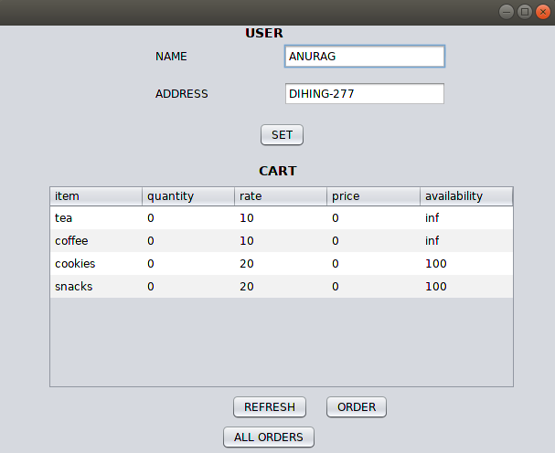

## How to run

Server:

	javac ShopServer.java

	java ShopServer

Client:

	javac ClientGUI.java

	java ClientGUI

### Problem Statement (Completed)
Suppose the tea stall of IITG Core-II is planning for “room delivery” service for the CSE, EEE, and DD faculty members and students. Write a program in java to build the system keeping in mind the following things:

a. A person can order tea, coffee, cookies, snacks etc., from a list of items online mentioning her/his lab/room.

b. Availability and expected time for delivery will be shown instantly after the order is placed.

c. Assume that

	i. Tea/coffee should never be unavailable.

	ii. Time required to prepare a cup of tea/coffee is 1 minute.

	iii. Time required to deliver the order is 2 minutes.

	iv. Stock of cookies, snacks, packaged food etc. is limited (e.g., 100 packets). When stock 
	reaches its minimum threshold value (e.g., 10), that item should be enlisted to the purchase list to maintain the stock.

	v. Multiple customers can place order at the same time.

	vi. All the items for a particular order should be delivered together.

	vii. Order should be delivered in FCFS manner.

d. An invoice should be generated mentioning the order details with price.

e. A sales list should be prepared with date, name of the customer, item, rate, quantity, and price. The total amount of sales (daily, monthly and for a particular period) should also be prepared.

Note that the program requires you to have idea on the following Java packages, in addition to the package required for concurrency.

1. The Swing package to make the interface for placing orders online.

2. The Java networking package to implement the online system (with clients and server).

